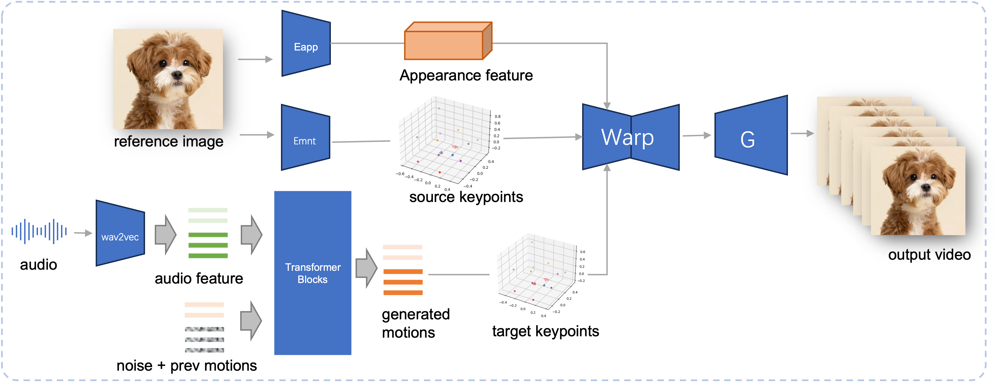

# JoyVASA: Portrait and Animal Image Animation with Diffusion-Based Audio-Driven Facial Dynamics and Head Motion Generation

## 📖 Introduction

We propose JoyVASA, a diffusion-based method for generating facial dynamics and head motion in audio-driven facial animation. Specifically, in the first stage, we introduce a decoupled facial representation framework that separates dynamic facial expressions from static 3D facial representations. This decoupling allows the system to generate longer videos by combining any static 3D facial representation with dynamic motion sequences. Then, in the second stage, a diffusion transformer is trained to generate motion sequences directly from audio cues, independent of character identity. Finally, a generator trained in the first stage uses the 3D facial representation and the generated motion sequences as inputs to render high-quality animations. With the decoupled facial representation and the identity-independent motion generation process, JoyVASA extends beyond human portraits to animate animal faces seamlessly. The model is trained on a hybrid dataset of private Chinese and public English data, enabling multilingual support. Experimental results validate the effectiveness of our approach. Future work will focus on improving real-time performance and refining expression control, further expanding the framework’s applications in portrait animation.

## 🧳 Framework



**Inference Pipeline of the proposed JoyVASA.** Given a reference image, we first extract the corresponding 3D facial appearance feature using the appearance encoder, and the learned motion information using the motion encoder. For the input speech, the audio features are initially extracted using the wav2vec2 encoder. The audio-driven motion sequences are then sampled using the diffusion model trained in the second stage in a sliding window fashion. Using the canonical source keypoints and the sampled target motion sequences, the target keypoints are computed. Finally, the 3D facial appearance feature is warped based on the source and target keypoints and rendered by a generator to produce the final output video.

## ⚙️ Installation

System requirements:

- Tested on Ubuntu 20.04, Cuda 11.3
- Tested GPUs: A100

Create environment:

```bash
# 1. Create base environment
conda create -n joyvasa python=3.10 -y
conda activate joyvasa 

# 2. Install requirements
pip install -r requirements.txt

# 3. Install ffmpeg
sudo apt-get update  
sudo apt-get install ffmpeg -y
```

## 🎒 Prepare model checkpoints

Download all the following checkpoints to `pretrained_weights`:

### 1. Download JoyVASA motion generator checkpoints


```bash
# Make sure you have git-lfs installed (https://git-lfs.com)
# git lfs install

git clone https://huggingface.co/jdh-algo/JoyVASA
```

### 2. Download audio encoder checkpoints

We suport two types of audio encoders, including [wav2vec2-base](https://huggingface.co/facebook/wav2vec2-base-960h), and [hubert-chinese](https://huggingface.co/TencentGameMate/chinese-hubert-base)

Run the following commands to download [hubert-chinese](https://huggingface.co/TencentGameMate/chinese-hubert-base) pretrained weights:

```bash
# Make sure you have git-lfs installed (https://git-lfs.com)
# git lfs install

git clone https://huggingface.co/TencentGameMate/chinese-hubert-base
```

To get the [wav2vec2-base](https://huggingface.co/facebook/wav2vec2-base-960h) pretrained weights, run the following commands:

```bash
# Make sure you have git-lfs installed (https://git-lfs.com)
# git lfs install

git clone https://huggingface.co/facebook/wav2vec2-base-960h
```

> *Note: The motion generation model with wav2vec2 encoder will be supported later*


### 3. Download LivePortraits checkpoints

```bash
# !pip install -U "huggingface_hub[cli]"
huggingface-cli download KwaiVGI/LivePortrait --local-dir pretrained_weights --exclude "*.git*" "README.md" "docs"
```

Refering to [Liveportrait](https://github.com/KwaiVGI/LivePortrait/tree/main) for more download methods.

### 4. `pretrained_weights` contents: 

The final `pretrained_weights` directory should look like this:

```text
./pretrained_weights/
├── insightface                                                                                                                                                 
│   └── models                                                                                                                                                  
│       └── buffalo_l                                                                                                                                           
│           ├── 2d106det.onnx                                                                                                                                   
│           └── det_10g.onnx   
├── JoyVASA
│   ├── motion_generator
│   │   └── iter_0020000.pt
│   └── motion_template
│       └── motion_template.pkl
├── liveportrait
│   ├── base_models
│   │   ├── appearance_feature_extractor.pth
│   │   ├── motion_extractor.pth
│   │   ├── spade_generator.pth
│   │   └── warping_module.pth
│   ├── landmark.onnx
│   └── retargeting_models
│       └── stitching_retargeting_module.pth
├── liveportrait_animals
│   ├── base_models
│   │   ├── appearance_feature_extractor.pth
│   │   ├── motion_extractor.pth
│   │   ├── spade_generator.pth
│   │   └── warping_module.pth
│   ├── retargeting_models
│   │   └── stitching_retargeting_module.pth
│   └── xpose.pth
├── TencentGameMate:chinese-hubert-base
│   ├── chinese-hubert-base-fairseq-ckpt.pt
│   ├── config.json
│   ├── gitattributes
│   ├── preprocessor_config.json
│   ├── pytorch_model.bin
│   └── README.md
└── wav2vec2-base-960h               
    ├── config.json                  
    ├── feature_extractor_config.json
    ├── model.safetensors
    ├── preprocessor_config.json
    ├── pytorch_model.bin
    ├── README.md
    ├── special_tokens_map.json
    ├── tf_model.h5
    ├── tokenizer_config.json
    └── vocab.json
```

## 🚀 Inference

### 1. Inference with command line

Animal:

```python
python inference.py -r assets/examples/imgs/joyvasa_001.png -a assets/examples/audios/joyvasa_001.wav --animation_mode animal --cfg_scale 2.0
```

Human:

```python
python inference.py -r assets/examples/imgs/joyvasa_003.png -a assets/examples/audios/joyvasa_003.wav --animation_mode human --cfg_scale 2.0
```

You can change cfg_scale to get results with different expressions and poses.

Note: *Mismatching Animation Mode and Reference Image may result in incorrect results.*


### 2. Inference with web demo
Use the following command to start web demo:

```python
python app.py
```
The demo will be create at http://127.0.0.1:7862.


## 📝 Citations
If you find our work helpful, please consider citing us:


## 🤝 Acknowledgments
We would like to thank the contributors to the [LivePortrait](https://github.com/KwaiVGI/LivePortrait), [Open Facevid2vid](https://github.com/zhanglonghao1992/One-Shot_Free-View_Neural_Talking_Head_Synthesis), [InsightFace](https://github.com/deepinsight/insightface), [X-Pose](https://github.com/IDEA-Research/X-Pose), [DiffPoseTalk](https://github.com/DiffPoseTalk/DiffPoseTalk), [Hallo](https://github.com/fudan-generative-vision/hallo), [wav2vec 2.0](https://github.com/facebookresearch/fairseq/tree/main/examples/wav2vec), [Chinese Speech Pretrain](https://github.com/TencentGameMate/chinese_speech_pretrain), [Q-Align](https://github.com/Q-Future/Q-Align), [Syncnet](https://github.com/joonson/syncnet_python), and [VBench](https://github.com/Vchitect/VBench) repositories, for their open research and extraordinary work.